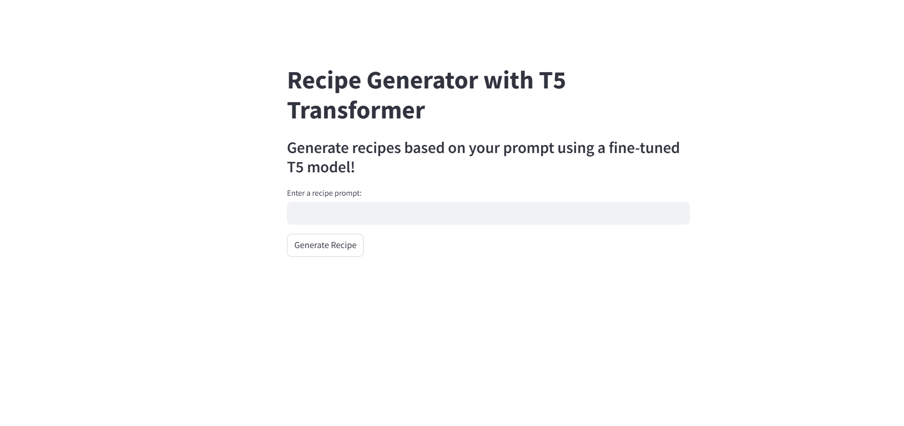

# Recipe Generator with T5 Transformer

A Streamlit web application that generates cooking recipes using a fine-tuned T5 transformer model. The model takes user prompts and creates unique recipe suggestions based on specified ingredients or requirements.

## Features

- Interactive web interface built with Streamlit
- Fine-tuned T5 transformer model for recipe generation
- Real-time recipe generation based on user prompts
- Text preprocessing and cleaning
- Support for both CPU and GPU inference

## Screenshot



## Installation

1. Clone the repository:
```bash
git clone https://github.com/Manish-Kumar24/RecipeForge-AI.git
cd RecipeForge-AI
```

2. Create a virtual environment (recommended):
```bash
python -m venv venv
source venv/bin/activate  # On Windows: venv\Scripts\activate
```

3. Install dependencies:
```bash
pip install -r requirements.txt
```

## Project Structure

```
recipe-generator/
├── assets/
│   └── output.png
├── fine_tuned_t5_recipe_model/
├── main.py
├── Recipe Generator With HuggingFace Transformer.ipynb
├── requirements.txt
└── unique_prompts_generated_recipes.csv
```

## Usage

1. Start the Streamlit application:
```bash
streamlit run main.py
```

2. Open your web browser and navigate to the provided local URL (typically http://localhost:8501)

3. Enter a recipe prompt in the text input field (e.g., "Generate a vegetarian recipe for dinner with tomatoes and spinach")

4. Click the "Generate Recipe" button to get your recipe

## Model Details

The application uses a fine-tuned T5 transformer model specifically trained on recipe data. The model processes natural language prompts and generates structured recipe outputs.

## Dependencies

- pandas
- streamlit
- torch
- transformers

## Contributing

### How to Contribute

1. Fork the repository
2. Create a new branch (`git checkout -b feature/improvement`)
3. Make your changes
4. Run tests if applicable
5. Commit your changes (`git commit -am 'Add new feature'`)
6. Push to the branch (`git push origin feature/improvement`)
7. Create a Pull Request
